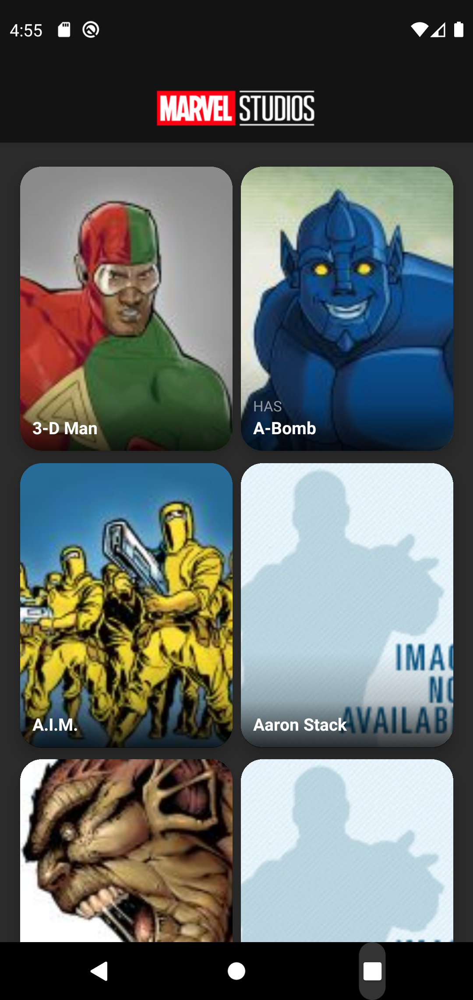
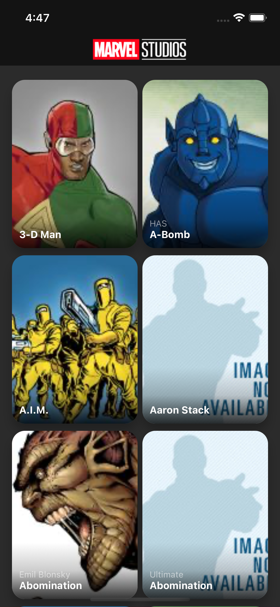
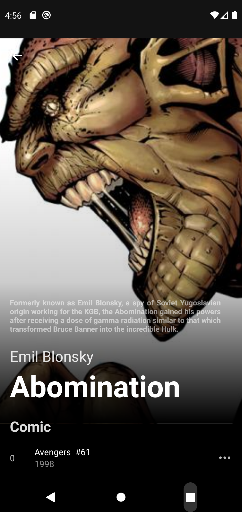
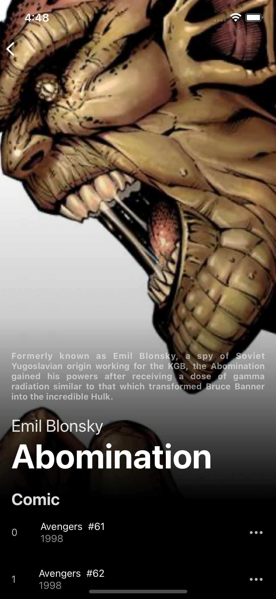

# MarvelApp

Code testing for iOS and Android using [Marvel API](https://developer.marvel.com/docs). With **Typescript**, **Redux**, **Sagas**, **Redux-toolkit**, **React-navigation v6** as core technologies for React-Native and developed with the Nx monorepo

## Screenshot

| android                                                                                   | ios                                                                               |
| ----------------------------------------------------------------------------------------- | --------------------------------------------------------------------------------- |
|  |  |
|  |  |

<br/>

---

## Proyect Info

> - React Native
> - Typescript
> - Monorepo Nx
> - Pattern
> - Redux, sagas, redux-toolkit, Jest
> - other libs and helpers

for more information see: [archivo.md](./more_info/archivo.md)

---

## Installation prerequisites

- The latest LTS version of [NodeJS](https://nodejs.org/es/) must be installed
- NodeJS package [yarn](https://yarnpkg.com/) must be installed.

Edit file `libs/marvel/services/src/lib/marvel.client.config.ts` with configuration local server in `publicKey` and `privateKey` with your own [Marvel API](https://developer.marvel.com/) developer keys

Install dependencies:

```
$ yarn
```

to start the app, execute

```
# for ios
$ yarn nx run-ios

# for android
$ yarn nx run-android
```

The first time it runs on iOS as on Android it may fail, when installing the native libraries. Just run it again and it will work again.

to start the test, execute

```
$ yarn test

or

$ yarn affected:test
```

The rest of the scripts can be seen in `package.json` that are destined for development
