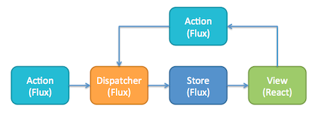

## Project Info

> - React Native
> - Typescript
> - Monorepo Nx
> - Pattern
> - Redux, sagas, redux-toolkit, Jest
> - other libs and helpers

### React native

At the time of development, the used version of React Native is v0.65.0-rc.2 and React v17.0.2.

All the code developed has been using the best practices of JavaScript ES6 and Typescript 4.

React Native recommendations have been followed. The components are developed with functions and with profuse use of hooks.

### TypeScript

[TypeScript](https://es.wikipedia.org/wiki/TypeScript) is a "superset of JavaScript, adding static typing and class-based objects."
Why use Typescript?

- **More explicit**. Explicit types allow you to focus your attention on exactly how your system is built and how the parts interact.
- **Reliability**. TypeScript code is more reliable and simple to refactor.

- **Interchangeability**. You can use all the libraries and JavaScript code you want in your TypeScript code. Also, you can gradually adopt TypeScript in your Javascript code base

### Monorepo Nx

Nx is a smart and extensible build framework to help you architect, test, and build at any scale — integrating seamlessly with modern technologies and libraries while providing a robust CLI, caching, dependency management, and more.
In addition to native applications, it is possible to share business logic with web applications that also use React.

For more information see [Nx Readme](./Nx.md)

### Pattern

Flux is an architecture for the management and flow of data in a web application, particularly in the Front-End. It was devised by Facebook and would replace the MV\* (MVC or MVVM or MVP) pattern.

Flux proposes an architecture in which the data flow is unidirectional. The data travels from the view through actions and reaches a Store from which the view will be updated again

### Redux, sagas, redux-toolkit

**Redux**
There are numerous implementations of the Flux pattern under development in JavaScript. Redux, today, is the most used and that has practically become a standard is Redux, created by Dan Abramov (software engineer at Facebook within the React.js team)

**Redux sagas**
Redux saga is a library that aims to make application side effects (i.e. asynchronous things like fetching data and impure things like accessing the database) easier to manage, more efficient to run, easy to test and better to handle failures.

Redux Saga is a very powerful library and although it adds a bit of complexity (compared to other solutions such as thunk) it allows development to evolve without problems.

**Redux toolkit**
It is a perfect complement to use with redux. Includes utilities to simplify common use cases like store setup, creating reducers, immutable update logic.

Provides good defaults for store setup out of the box, and includes the most commonly used Redux addons built-in

**Jest**
Jest is a framework created by Facebook and maintained by the community with support from Facebook. It is easy to install and does not require a very complex configuration to be able to add it to our projects.

To carry out our testing tests we are going to create a project and thus be able to test everything we need.

To carry out our testing tests we are going to create a project and thus be able to test everything we need.

### other libs and helpers

**other libs**

- [react-navigation](https://reactnavigation.org/)
- [react-native-vector-icons](https://github.com/oblador/react-native-vector-icons)
- [react-native-fast-image](https://github.com/DylanVann/react-native-fast-image)
- [react-native-linear-gradient](https://github.com/react-native-linear-gradient/react-native-linear-gradient)

**helpers**

[ESLint](https://eslint.org/)
The project has ESLint built in, ESLint statically analyzes the code to find problems quickly.

ESLint is built into most text editors and you can run ESLint as part of your continuous integration process.

[Storybook](https://storybook.js.org/)
The project has not integrated a Storybook because version 6 is not available, although it would have been desirable to have this tool

Storybook is an open source tool for building UI components and pages in isolation. It streamlines UI development, testing, and documentation.
